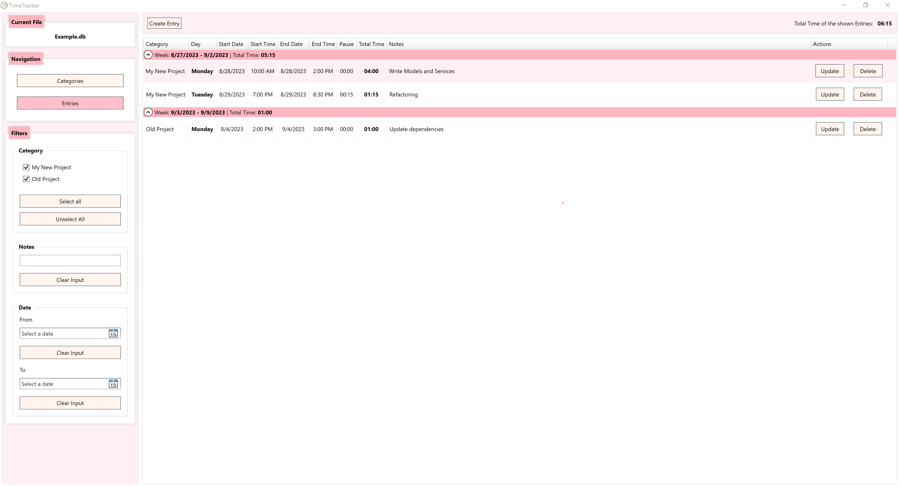

TimeTracker
===========

Introduction
------------

This WPF application lets the user track the time spent for different categories and provides useful features like
filtering the time entries by their category, their notes or their dates.

__An overview of the application features:__

* Create categories and time entries.

* Filter the entries by category, notes or dates (min and max date).

* Create and use different database files e.g. for different purposes, years etc.

Screenshot
----------



Included dependencies
---------------------

| Dependency                           | Version | Notes                                                |
|--------------------------------------|---------|------------------------------------------------------|
| .NET                                 | 7       |                                                      |
| Microsoft.EntityFrameworkCore        | 7.0.10  | Used for ORM                                         |
| Microsoft.EntityFrameworkCore.Sqlite | 7.0.10  | Used for storing data in a SQLite file               |
| Microsoft.Xaml.Behaviors.Wpf         | 1.1.39  | Used for binding commands to events of XAML elements |
| NUnit                                | 3.13.3  | Used for unit tests                                  |


Configuration
-------------

The required configuration file for the last used database files will be added next to the application and is created 
automatically when running the application.


Structure
---------

The application code contains the following main directories:

* Converters
* Dialog
* Migrations
* Models
* Resources
* Start
* Utils
* ViewModels
* Views

In the following, the usage of each mentioned directory is outlined.

### Converters

The 'Converters' directory contains converters, especially those for the WPF bindings.

To make the converters accessible in each View (i.e. in each XAML file) without importing them all over again,
they are instantiated inside the [Converters.xaml](TimeTracker/Resources/Converters/Converters.xaml) of the
'Resources' directory which is added to the resources of [App.xaml](TimeTracker/Start/App.xaml).

### Dialog

The 'Dialog' directory contains the logic to show the View of a dialog and connect it with the related ViewModel. 

This logic is placed inside the separate 'Dialog' directory since usual the ViewModels should have __no__ access to
the Views at best. However, by dynamically opening dialogs from within a ViewModel (e.g. when a special command is 
executed), the ViewModel in fact needs this access. Thus, to hold the coupling as low as possible, the separate 
'Dialog' directory is used as a connector between the ViewModels and the Views.

So, the call hierarchy looks like this: ViewModels => Dialog => Views.

### Migrations

The database migrations created by EntityFramework (and maybe adjusted by the developer) are located in the
Migrations namespace.

### Models

The 'Models' directory contains the basic data types and services providing the business logic of the application.

The Model classes will be used by the ViewModels to manipulate the data according to the user's wish which is triggered
by the user's actions in the GUI.

### Resources

The 'Resources' directory contains the app resources like icons, styles and translation strings.

### Start

The 'Start' directory marks the entry point of the application.
Precisely, the entry point is the Code-Behind [App.xaml.cs](TimeTracker/Start/App.xaml.cs) of the applications
starting file [App.xaml](TimeTracker/Start/App.xaml).

Before opening the MainWindow, the user has to create or select an database file.

Note that the MainWindow is located in the 'Start' but not in the 'Views' directory because it is responsible for 
initializing and connecting both the Views and ViewModels.

### Utils

The 'Utils' directory contains some helpful classes that are responsible for e.g. setting up the dependencies for the
app files or for the internationalization of the application.

### Views

The 'Views' directory contains the GUI declarations of the application, i.e. the XAML files and their Code-Behinds. 
It does __not__ know the ViewModel but uses bindings to get the runtime values and actions.

### ViewModels

The 'ViewModels' directory contains the ViewModels which provide the presentation logic of the Views but have no direct 
access to the View classes.
Instead, the Views are connected on runtime by bindings to the ViewModel's data and actions.

As an example, the actions triggered by the user in the GUI are declared here.

Note that using the [DialogService](TimeTracker/Dialog/DialogService.cs) slightly breaks the separation of Views and 
ViewModels since it knows both the View and the ViewModel.


Build and use the application
-----------------------------

Inside the solutions root (in the directory where this README is placed), run the following command to create
a single file application:

```
dotnet publish TimeTracker `
     -c=Release `
     -r=win-x64 `
     -o ./publish `
     --self-contained=true `
     -p:PublishSingleFile=true `
     -p:IncludeNativeLibrariesForSelfExtract=true `
     -p:DebugType=None `
     -p:DebugSymbols=false
```

You can just start the application in place without doing any configurations. All required configuration files will
be created automatically when running the application.